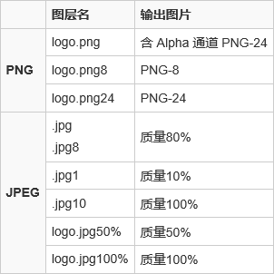

> 多用才行

## 滤镜

可以多用

## 图像下的调整

## 属性栏

菜单栏下的一栏是属性栏，是针对工具来说的

调整图像色彩等等

## 工具 左侧

> 工具的操作是针对选区

> 相应快捷键（英文输入法），快速跳转

> shift+相应快捷键（英文输入法），转换不同选项

### 移动工具 V

选择 改成选择图层（一般是对图层操作） 改大小、移动等

选择多个图层可以选择对齐方式

### 选区工具 M规则 L不规则

> 工具的操作是针对选区

规则、不规则的区域选择

选区的加（并）减（差）乘（交）

	shift 长方形变正方形，椭圆变圆
	alt 确定圆心
	shift 加 
	alt 减
	ctrl+d 删除选区

多种工具结合

### 快速选择W

结合alt（减）使用

单击、拖动（拉）

	选区针对图层，选了之后可以做很多，包括填充等等

切片 切图

吸管 吸色

污点修复 按住alt键取色再涂抹

画笔 与吸管结合使用

钢笔的属性栏：形状与路径的区别

## 图层

合并

显示

## 窗口

是在工作区下做作业的，默认是基本功能，可以新建工作区

比较重要的有图层、信息、字符。信息会给出位置，rgb颜色分量。

## 关于单位

web开发大多情况改成像素

1920*2000的大小1200*2000的内容。H可以不断增加

## 快捷键

需要英文输入法才行

## 
视图 新建参考线

## 切图
切片

基于参考线的切片

分模块裁剪再切

### 脚本

1、导出图层到文件

2、自动切图 需要CC版本……

	启用生成器（编辑、首选项）
	生成图像资源（文件）
	重命名为png、jpg

优化、增效

	名字前加x%，200%使图片更清晰(Retina)
	jpg后面加8，质量为80%
	300x300 图一.jpg，指定大小输出

svg矢量图

	直接重命名为svg
	灰常小（更多针对按钮等简单图，复杂图片还是很大滴）
	修改代码去掉宽高可实现图片的自适应！

webp
	
	与svg同

抽出资源
	
	文件、抽出（需要选中相应图层）
	导出svg等

复制css
	
	图层、复制css，需要ps cc版本
	css自动生成
	智能对象暂不支持“复制 CSS”功能，您可以栅格化该图层再来使用
	
图层管理

	图层过滤筛选定位